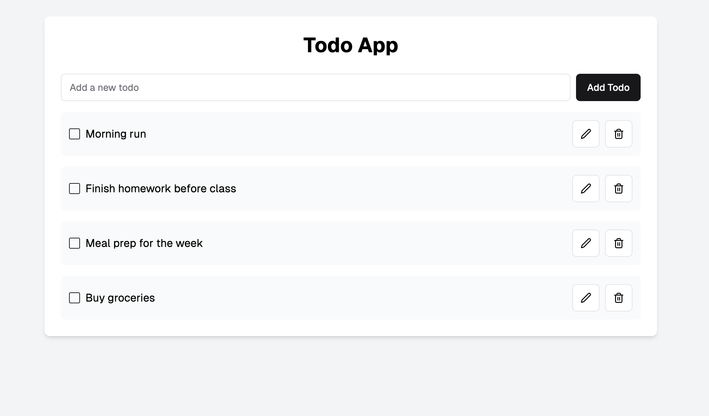

> **Note:** This repository is a personal backup of coursework originally developed as part of my studies at Cornerstone College. It was cloned from a institutional and private repository to preserve my contributions and development history.

# Todo App with PG

To get started run: 
```
npm install
```
then
```
npm run dev
```

Open the following link to get a response from the server: 
> http://localhost:8000/api/v1/projects


## Assignment Objective: 
- Create a API server connected to psql database
- User should be able to enter, edit or remove a todo item (CRUD)
- Data should be stored inside the psql database, you are can name your database and tables of your choice 
- Use EJS for this assignment


## Below is a example UI for your this assinment, you can use this as a reference.



Use should be able to mark a task as done or edit it: 


Notes: 
 * Focus on the nodeJS-postgres integration with pg library & CRUD operations
 * You can work on the endpoints (with Postman) first, and then create the UI. 
